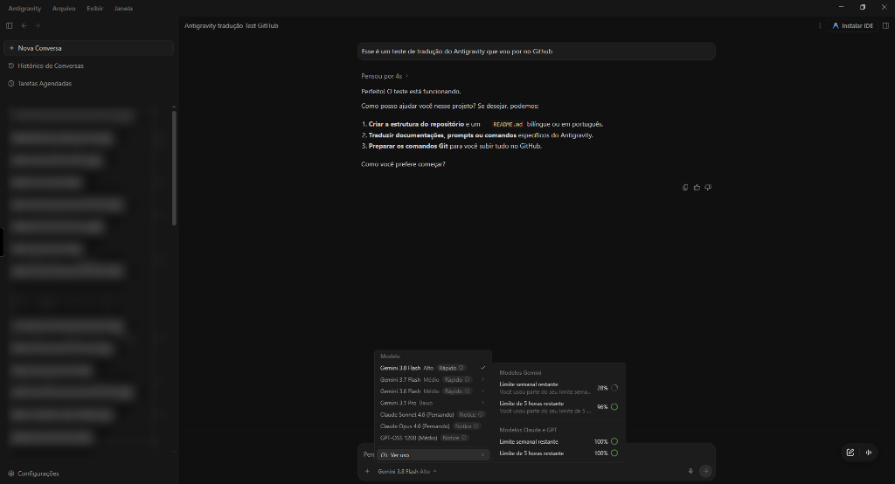
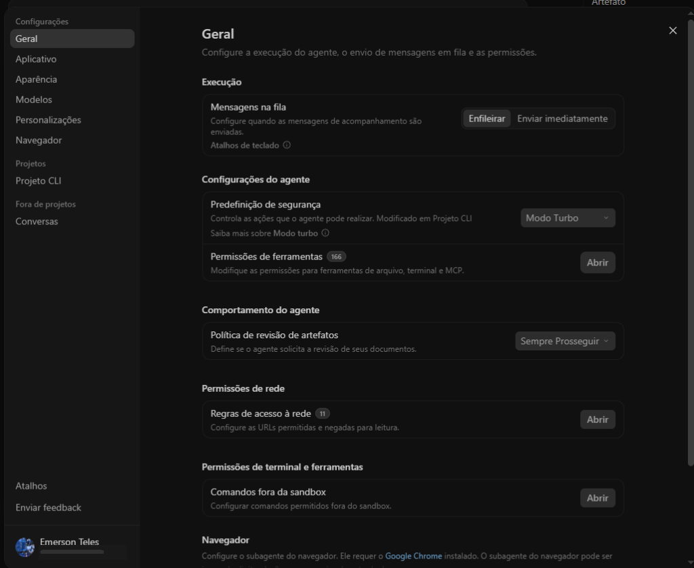

# 🌐 Google Antigravity — Tradução para Português do Brasil (PT-BR) 🇧🇷


-green?style=for-the-badge)

Pacote portátil definitivo de localização completa do **Google Antigravity Desktop** para Português do Brasil (pt-BR). Tradução profunda cobrindo tanto o núcleo do aplicativo Electron (modular ASAR de 4.5 MB) quanto a interface web gráfica (`web-bundle`), diálogos de permissão, configurações, comandos de agentes, bandeja do sistema e painel de conversas.

---

## 📸 Demonstração Visual

<p align="center">
  
  <br>
  <em>Interface Principal, navegação, modelos e chat 100% em Português do Brasil</em>
</p>

<p align="center">
  
  <br>
  <em>Painel de Configurações, Segurança, Execução, Permissões e Ferramentas totalmente localizado</em>
</p>

---

## 📋 Índice
1. [Sobre o Pacote](#-sobre-o-pacote)
2. [Demonstração Visual](#-demonstração-visual)
3. [O que Foi Traduzido](#-o-que-foi-traduzido)
4. [Estrutura da Pasta](#-estrutura-da-pasta)
5. [Como Instalar](#-como-instalar-em-2-cliques)
6. [Como Restaurar o Original de Fábrica](#-como-restaurar-o-original-de-fábrica)
7. [Sistema de Backup Modular e Segurança](#-sistema-de-backup-modular-e-segurança)
8. [Diretórios do Sistema](#-diretórios-no-computador)
9. [Padrão de Terminologia Oficial](#-padrão-de-terminologia-oficial)
10. [Créditos e Autoria](#-créditos-e-autoria)

---

## 🌟 Sobre o Pacote

Este pacote foi arquitetado para oferecer uma experiência nativa em português sem qualquer atrito:
* **Portátil e Autônomo:** Pode ser executado de qualquer pasta (ex: `C:\Projetos`, `Área de Trabalho`, `Downloads`, `Pen-drive`, `HD Externo`), sem requerer internet nem downloads extras.
* **Patcher dinâmico do núcleo Electron:** Detecta a versão instalada e preserva o número oficial. A compatibilidade da interface web depende da estrutura do bundle fornecido.
* **Execução Independente e Desacoplada:** O inicializador integrado executa o aplicativo em processo isolado, sem poluir seu terminal com logs de debug e sem fechar o Antigravity ao fechar o script.
* **Segurança do Motor do Agente:** Preserva estritamente os processos em background do `language_server.exe` para que seus assistentes de IA nunca sejam interrompidos abruptamente.
* **Blindagem dos Editores de Chat:** Proteção avançada que garante que componentes de texto rico (Lexical, Slate e Monaco Editor) nunca sofram quebras de concorrência DOM ou travamentos nas conversas.

---

## 🎯 O que Foi Traduzido

| Área | Elementos Traduzidos |
| :--- | :--- |
| **Tela de Boas-Vindas & Início** | "Bem-vindo ao Antigravity", tela de autenticação, botões de conta Google e Workspace, assistente de primeiro uso localizado. |
| **Barra Lateral & Histórico** | "Nova conversa", "Histórico de conversas", "Tarefas agendadas", "Projetos", "Fixados", "Recentes", filtros e pesquisa rápida. |
| **Painel de Chat & Mensagens** | Prompts do usuário, respostas do assistente, avaliação de passos, botão "Parar Tarefa", "Processo de pensamento...", botões de ação e feedback. |
| **Diálogos de Permissão** | Solicitações de autorização de terminal ("Solicitando sua permissão no Terminal:"), comandos shell, scripts JavaScript e abertura de URLs externas. |
| **Configurações Globais** | Menus de Aparência, Geral, Temas (Claro, Escuro, Sistema), Personalização de Regras, Habilidades (Skills), Sidecars e Servidores MCP. |
| **Menus Nativos do Windows** | Barra superior (Arquivo, Nova Janela, Editar, Exibir, Janela, Ajuda e "Verificar Atualizações"). |
| **Bandeja do Sistema (Tray)** | Status de agentes ativos ("Nenhum agente em execução", "X agentes em execução"), "Abrir Antigravity" e "Sair". |
| **Assistente da IDE & Setup** | Diálogos de onboarding, instalação da extensão no VS Code e configuração de rotas. |
| **Erros e Alertas do Agente** | Mensagens de diagnóstico ("Execução do agente encerrada devido a erro.", reconexão com servidor, erros de rede e avisos de limite). |

---

## 📂 Estrutura da Pasta

```text
<pasta-do-projeto>\
├── Instalar-Traducao.bat    # Atalho rápido: aplique a tradução com 2 cliques
├── Restaurar-Original.bat   # Atalho rápido: volte ao original de fábrica em 1 clique
├── aplicar-traducao.ps1     # Script mestre PowerShell com barra de progresso visual
├── restaurar-original.ps1   # Script de restauração modular e limpeza segura
├── patch-antigravity.cjs    # Motor dinâmico automatizado sem downgrade
├── tools/                   # Auditoria da interface e validação de backups
│   ├── scan-untranslated.cjs
│   └── verify-clean-asar.cjs
├── app-pt.asar              # Gerado localmente; ignorado no Git por ser pacote compilado
├── web-bundle/              # Pacote da interface web gráfica traduzida (React/Tailwind)
│   ├── main.js              # Bundle da interface traduzida em PT-BR por Emerson Teles
│   ├── index.html           # Ponto de entrada da interface
│   ├── compiled_tailwind.css# Estilos visuais e temas
│   └── ...
├── README.md                # Este guia completo em formato Markdown moderno
├── README.ag                # Guia idêntico para visualizadores e editores integrados
├── AGENTS_PTBR.md           # Diretrizes operacionais para subagentes em Português
└── LEIA-ME.txt              # Manual em texto puro para visualização rápida no Bloco de Notas
```

---

## 🚀 Como Instalar (em 2 cliques)

1. **Feche o Antigravity** caso a janela do aplicativo esteja aberta.
2. Dê um duplo clique no arquivo:
   ```cmd
   Instalar-Traducao.bat
   ```
3. O instalador automático irá:
   - Identificar a pasta oficial de instalação no seu Windows.
   - Criar um backup de fábrica modular em `_backups\<versão>\app.asar`.
   - Executar o **Patcher Dinâmico**, instalando o núcleo traduzido (`app.asar`) e a interface gráfica web (`web-bundle`).
   - Renovar o cache do Chromium para que a tradução apareça de imediato.
4. Ao final, digite `S` para abrir; `N`, `Enter` ou `Esc` fecha sem abrir o **com a tradução PT-BR aplicada à versão instalada**!

---

## 🔄 Como Restaurar o Original de Fábrica

Se desejar retornar o Antigravity exatamente ao padrão original em inglês:
1. Dê um duplo clique no arquivo:
   ```cmd
   Restaurar-Original.bat
   ```
2. O restaurador detectará a versão instalada, recuperará o backup original de fábrica em `_backups\<versão>\app.asar` e restaurará o `web-bundle` original salvo para essa versão.
3. Seu Antigravity voltará a ser o original genuíno instantaneamente.

---

## 🛡️ Sistema de Backup Modular e Segurança

A integridade do seu aplicativo é prioridade máxima:
* **Backup de Fábrica Modular por Versão:** Antes de realizar qualquer alteração, o instalador cria uma cópia idêntica do `app.asar` original na pasta:
  `<pasta-do-Antigravity>\_backups\<versão>\app.asar`.
* **Proteção contra Sobrescrita:** O backup original de fábrica nunca é substituído nem apagado em instalações posteriores.
* **Reaplicação Segura:** Se a instalação já estiver traduzida e houver backup original limpo da mesma versão, o patch parte desse backup. Se detectar um `web-bundle` traduzido sem original correspondente, interrompe a instalação; restaure/reinstale a mesma versão original e execute novamente.
* **Pasta do Projeto:** Scripts, documentação e arquivos de tradução ficam juntos no projeto. Backups brutos são armazenados somente em `<pasta-do-Antigravity>\_backups\<versão>\`.
* **Preservação de Processos:** O `language_server.exe` nunca é finalizado abruptamente para garantir a continuidade dos agentes.

---

## 📍 Diretórios no Computador

* **Diretório do Aplicativo:**
  `%LOCALAPPDATA%\Programs\antigravity\`
* **Diretório de Recursos do Electron:**
  `%LOCALAPPDATA%\Programs\antigravity\resources\`
* **Pasta Segura de Backup Original:**
  `%LOCALAPPDATA%\Programs\antigravity\_backups\`
* **Diretório de Dados e Configurações:**
  `%USERPROFILE%\.gemini\antigravity\`

---

## 📐 Padrão de Terminologia Oficial

Este pacote segue rigorosamente os padrões de qualidade e naturalidade definidos por **Emerson Teles**:
* **"aplicativo" / "aplicativos"** — Usado sempre; nunca "app" ou "apps" isolados.
* **"tokens"** — Mantido tecnicamente correto; nunca traduzido para "fichas".
* **"Direcionar"** — Tradução precisa para a função *Steer*.
* **"ativar" / "desativar"** — Padronizado no lugar de "habilitar / desabilitar".
* **"espaço de trabalho"** — Tradução consistente para *workspace*.

---

## ✍️ Créditos e Autoria

* **Tradução PTBR - Emerson Teles**
* **Engenharia e Arquitetura:** Emerson Teles
* **Localização:** Português do Brasil (`pt-BR`)
* **Distribuição:** Pacote portátil, autônomo e de alta confiabilidade.

*Google Antigravity é uma marca registrada da Google LLC. Este pacote de tradução é uma personalização desenvolvida de forma independente por Emerson Teles.*

---

## 👤 Sobre o Autor

Desenvolvido e mantido por **Emerson Teles** (conhecido na comunidade como **Emertels**).

Apaixonado por tecnologia, informática, jogos, manutenção de sistemas e tradução/localização de softwares e emuladores para o Português do Brasil (PT-BR).

### 🛠️ Projetos & Contribuições Notáveis:
- **Suítes de Automação & Utilitários no GitHub:**
  - **[Suite-Emuladores](https://github.com/Emertels/Suite-Emuladores)** — Suíte inteligente em PowerShell para download e atualização autônoma de 56 emuladores e frontends.
  - **[PSBBN-Translator](https://github.com/Emertels/PSBBN-Translator)** — Suíte corporativa de tradução e localização para o PSBBN Definitive Project no PS2 (40 idiomas).
  - **[AI-Chat-Vault](https://github.com/Emertels/AI-Chat-Vault)** — Backup portátil e recuperação de conversas locais de 20 IAs agênticas e ferramentas de programação.
  - **[Microsoft-Photos-Fix](https://github.com/Emertels/Microsoft-Photos-Fix)** — Correção avançada em PowerShell e C# para rota de abertura e papel de parede no Microsoft Fotos.
  - **[Roccat-Syn-Pro-Air-Fix](https://github.com/Emertels/Roccat-Syn-Pro-Air-Fix)** — Suíte definitiva de estabilização, áudio e blindagem anti-queda para headset sem fio.
- **Emulação & Consoles:** Criador e arquiteto da **[PSBBN-Translator](https://github.com/Emertels/PSBBN-Translator)** para o PS2 (40 idiomas); localização e suporte a emuladores como **PSBBN**, **PCSX2**, **Dolphin**, **shadPS4**, **Azahar** e **RetroArch**.
- **Softwares & Utilitários:** Tradução 100% de **DSX** (DualSense X - Trusted Translator), **ASUS GPU Tweak III**, **dnGrep**, **XWidget** e ferramentas web (**DualSense Tester**, **DualShock Tools**).
- **Jogos:** Tradução de **Silent Hill 5: Homecoming**, projetos em andamento em **Silent Hill 4: The Room** e diversos outros aplicativos.

---

### 🌐 Conecte-se comigo & Comunidades Oficiais:

<div align="left">

[](https://github.com/emertels)
[](https://emertels.github.io)
[](https://emertels.github.io/discord)
[](https://x.com/emertels)
[](https://www.youtube.com/@emersonteles2379)
[](https://t.me/apksmodsandroid)
[](https://ko-fi.com/emertels)

</div>
